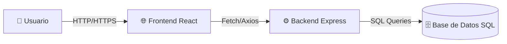

🌸 Jazmín App

Aplicación web full stack para gestionar y visualizar listas personalizadas de perfumes.
Los usuarios pueden registrarse, iniciar sesión y crear sus propias listas de perfumes con información detallada (marca, puntuación, etiquetas, foto, etc.).

📝 Tabla de contenidos

Características

Tecnologías

Modelo de datos

Instalación

Uso

Despliegue

Organización del proyecto

✨ Características

Autenticación de usuarios: registro e inicio de sesión.

Gestión de perfumes: cada usuario puede crear, listar y puntuar sus perfumes.

Aplicación mobile-first: diseño responsivo para móvil como prioridad.

Interfaz moderna: HTML5 semántico y estilos en SASS.

Asincronía HTTP: consumo de API mediante peticiones HTTP (fetch/axios).

Persistencia SQL: manejo de datos en base de datos relacional.

🛠 Tecnologías
Frontend

React

HTML5 semántico

SASS

Mobile-first design

Backend

Node.js con Express

SQL para gestión de base de datos

Infraestructura

Docker para contenedores

Render para despliegue

GitHub para control de versiones

Trello para la organización del proyecto

🗂 Modelo de datos

El modelo relacional principal consta de dos tablas:

Usuarios

id_usuario (PK)

Correo

Contraseña

Perfumes

id_perfume (PK)

Nombre

Marca

Foto

Puntuación

Etiqueta

id_usuario (FK)

Cada perfume pertenece a un usuario, permitiendo listas personalizadas.

## 🏗️ Arquitectura del sistema

🚀 Instalación

Clona el repositorio:

git clone https://github.com/choski91/web_perfumes.git

Entra al directorio del proyecto e instala dependencias:

Backend

cd backend
npm install
npm run dev

Frontend

cd frontend
npm install
npm start

Configura variables de entorno para la conexión a la base de datos en .env.

📱 Uso

Regístrate o inicia sesión.

Crea tu lista personalizada de perfumes.

Agrega, edita y puntúa perfumes.

🌐 Despliegue

La aplicación se encuentra desplegada en Render usando Docker.

Puedes acceder al proyecto desde: 

📋 Organización del proyecto

GitHub: control de versiones

Trello: planificación y seguimiento de tareas durante 7 días de desarrollo.

⏳ Tiempo de desarrollo

7 días

🧑‍💻 Autora

María Laura Smichowski
